# 🍇 Struguraș de la Grigoraș – Landing Page

This is a landing page for Struguraș de la Grigoraș, a small family winery in Zgurița, Soroca, Moldova. The page highlights the winery’s story, the vinification process, upcoming events, gallery of photos, and provides a contact form for visitors. The design is responsive, visually pleasing, and includes a dark/light mode toggle.

## 🎯 Features

- Pleasant, elegant design: Warm color palette and balanced layout for a comfortable viewing experience
- Dark/Light mode: Switchable themes for user comfort
- Interactive elements: Hover effects in gallery and buttons to engage visitors
- Easy navigation: Sticky header and smooth scrolling between sections
- Built with vanilla HTML and CSS, no frameworks used

## 📸 Screenshots

### Hero Section

    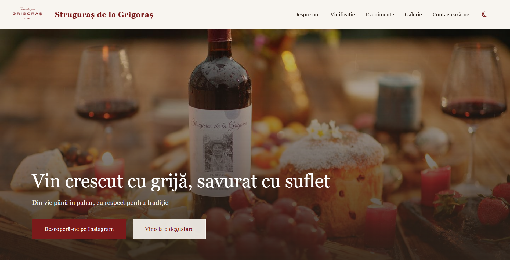
    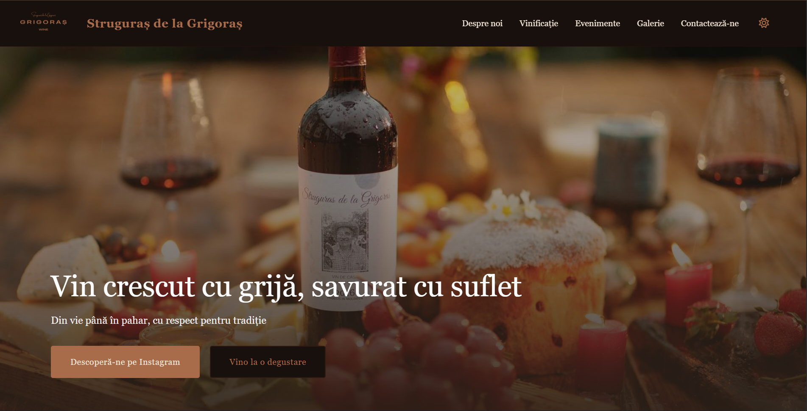

### About section

<table>
  <tr>
    <td>
      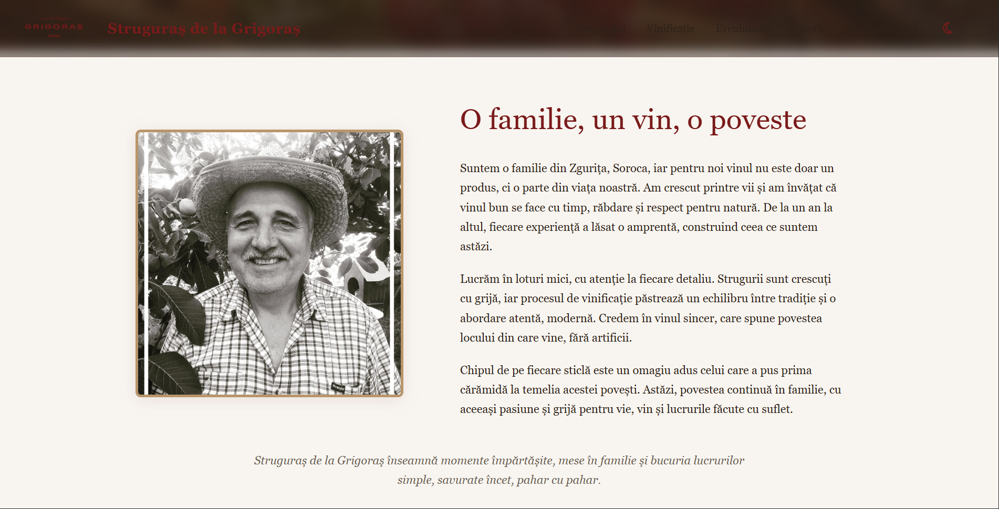 
      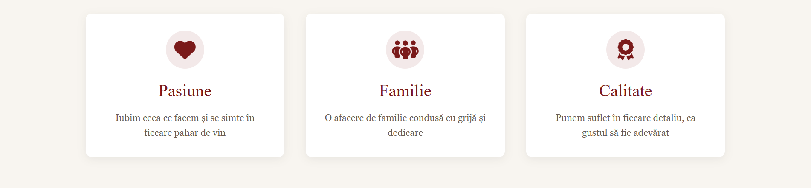 
    </td>
    <td>
      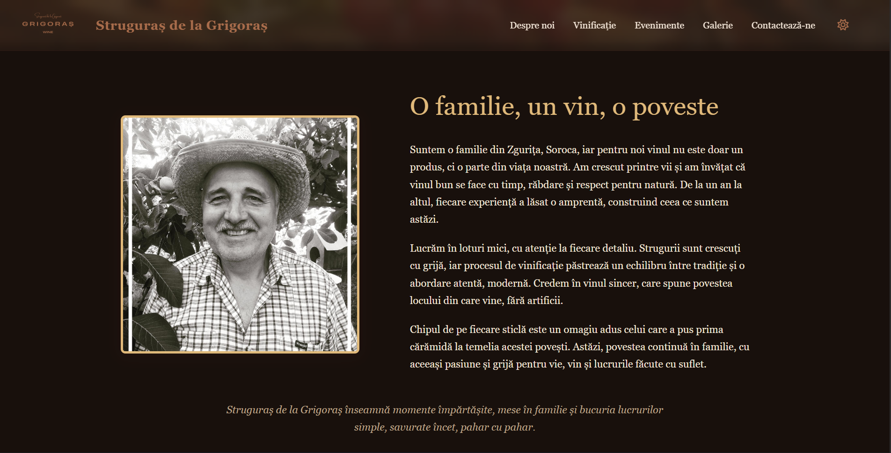 
      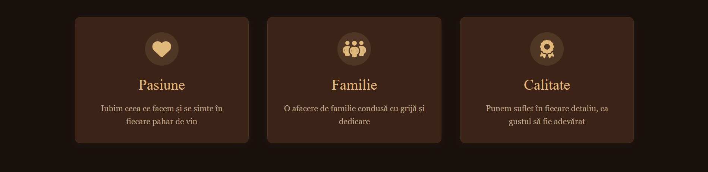 
    </td>
  </tr>
</table>

### Vineyard section

    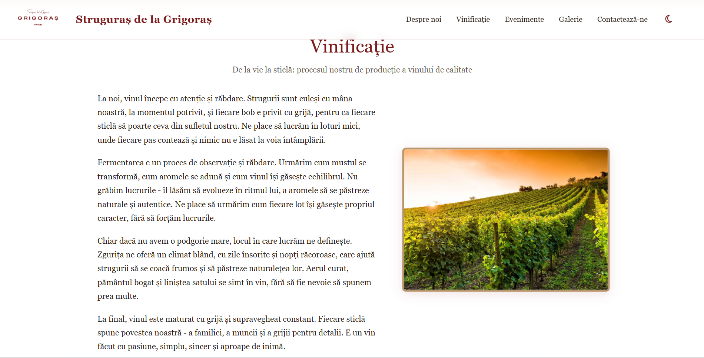
    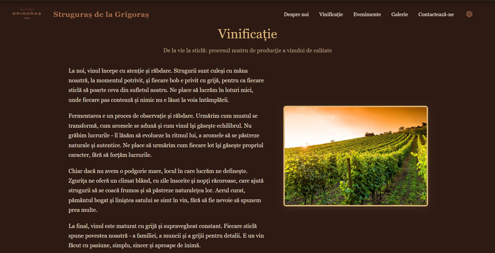

### Events section

<table>
  <tr>
    <td>
      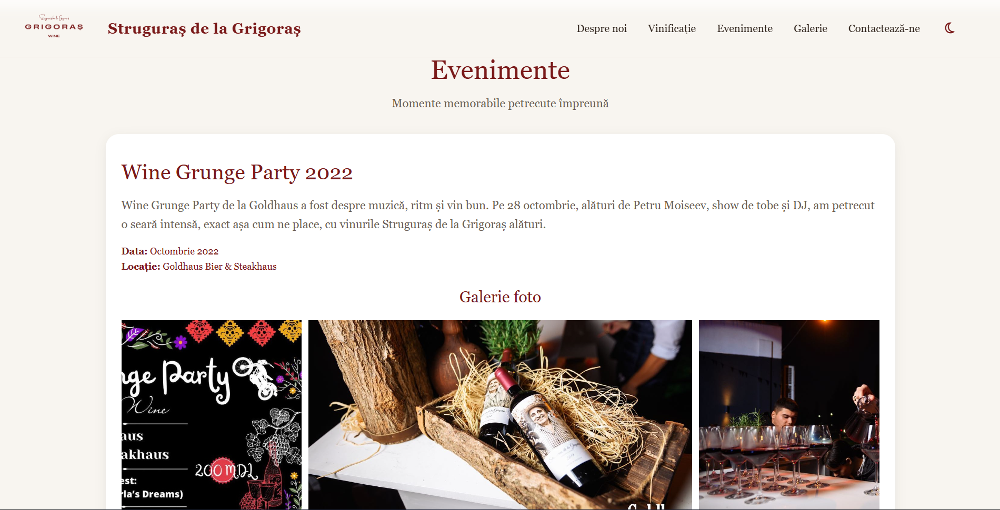 
      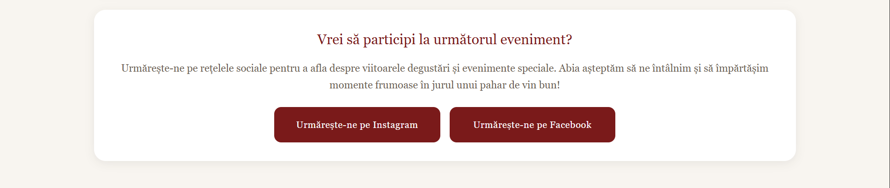 
    </td>
    <td>
      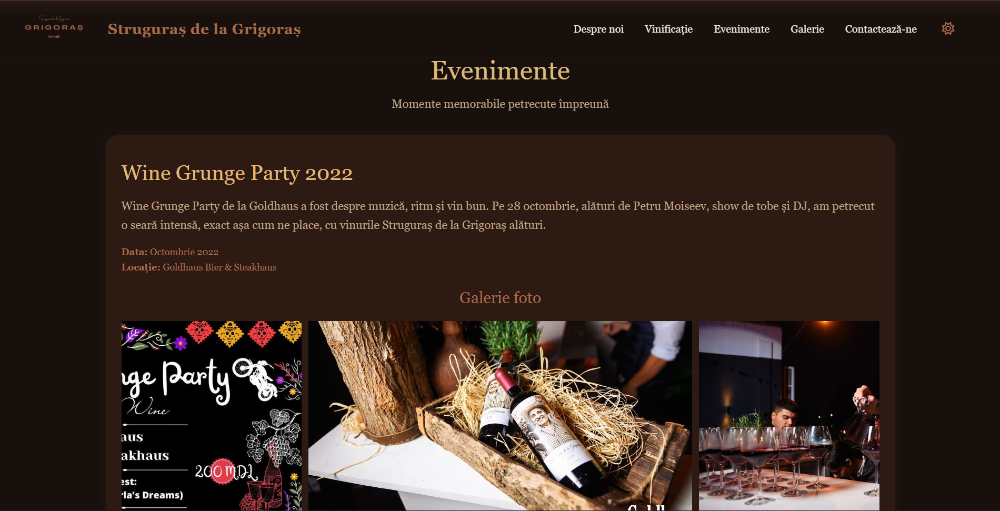 
      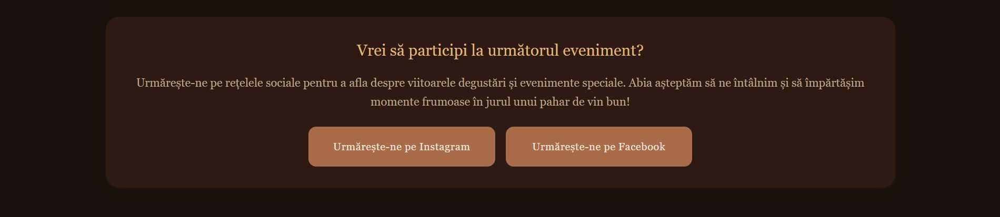 
    </td>
  </tr>
</table>

### Gallery section

    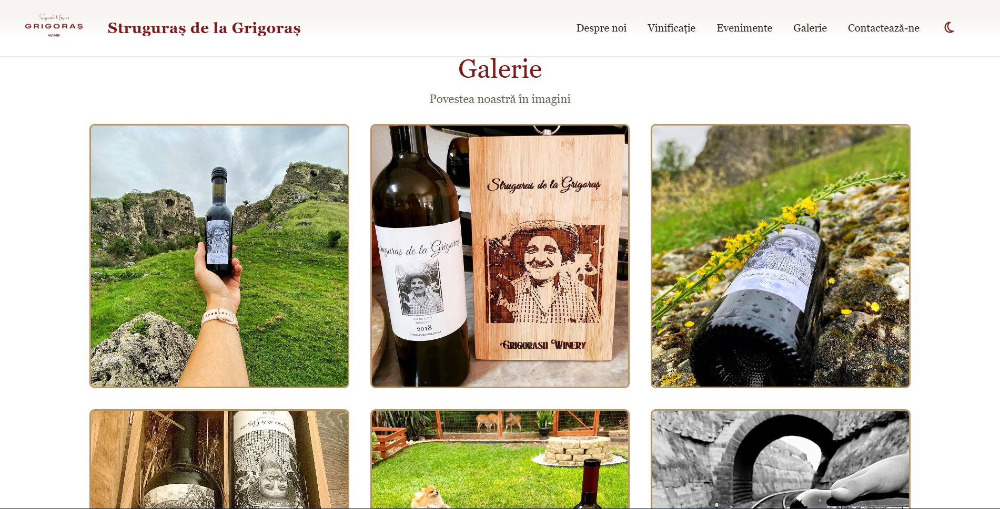
    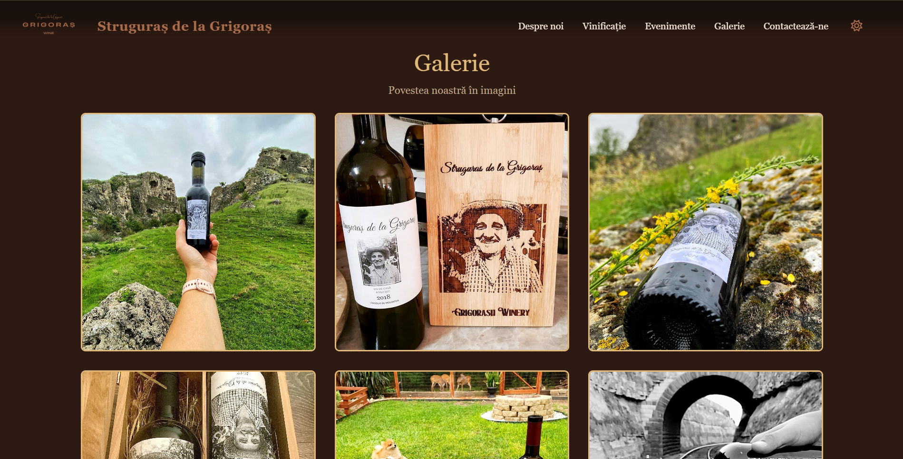

### Contacts section

    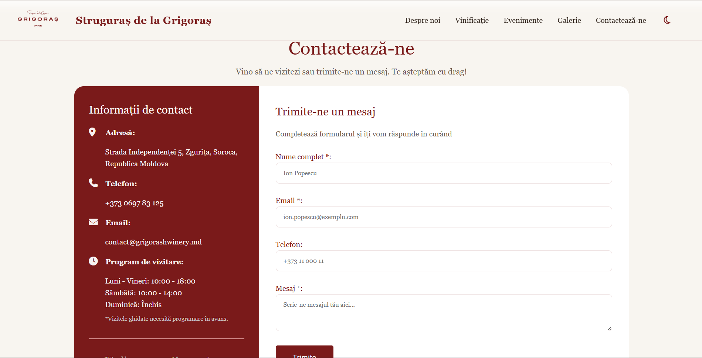
    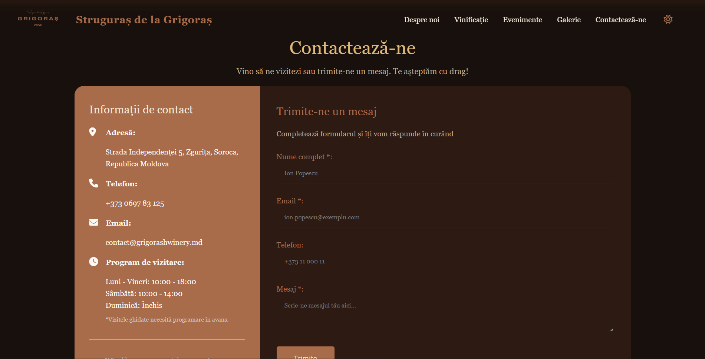

### Footer

    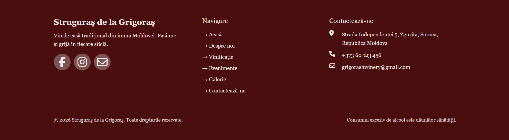
    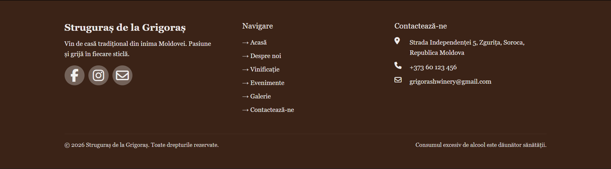

## 🌐 Live Demo

Check the live landing page here: [Struguraș de la Grigoraș](https://janeta1.github.io/tum-web-lab2/)

## 🛠 Technologies Used

- **Frontend:** HTML, CSS, Vanilla JS
- **Icons:** Font Awesome
- **Hosting:** GitHub Pages

---

## 🚀 Lab 3 - Responsive Design & Animations

### ✨Responsive Design

- All elements adjusted for desktop/mobile/tablet viewports
- Fixed visualization issues: horizontal overflow, text wrapping, sticky header positioning
- Responsive breakpoints: 480px (mobile), 768px (tablet), 1100px (desktop)
- Call to action buttons remain visible and accessible on all screen sizes

### 📱Mobile-Only Elements

- Hamburger menu toggle: Appears only on mobile view (≤768px)
- Slide-down animated navigation menu with smooth transitions
- Mobile-specific dark mode toggle within the menu
- Auto-closes when clicking navigation links
- Proper accessibility with `inert` attribute

### 🍇 Mascot

- Grape-themed SVG mascot related to winery topic
- Friendly, cartoon-style design matching the wine color palette
- Appears after 2.2 seconds delay at bottom-right corner
- Animated with continuous floating motion and subtle rotation
- Jump animation triggers on click, scrolling to contact form
- Hover message displays: *"Mesajul tău e ca un vin bun: abia aștept să-l descopăr!"*

### 🎨 CSS Framework Migration

- Integrated TailwindCSS via CDN
- Configured custom color palette using CSS variables for theme switching
- Migrated multiple sections to Tailwind utility classes: About, Vineyard, Events, and Footer sections (grid layouts, responsive columns, typography, spacing)
- Dark mode support configured to work with existing dark/light mode toggle

